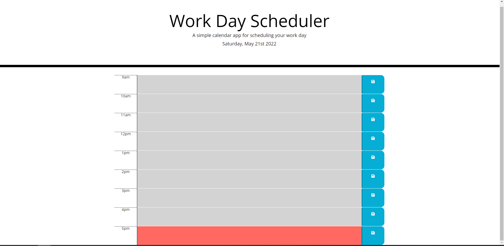

# Work Day Scheduler

# Purpose

Create a simple calendar application that allows a user to save events for each hour of the day. This app will run in the browser and feature dynamically updated HTML and CSS powered by jQuery.

# Built With

- HTML
- CSS
- JavaScript
- LocalStorage

## Image

# Website Repo

https://github.com/DanielCConlon/work-day-scheduler

# GitHub Pages

https://danielcconlon.github.io/work-day-scheduler/
